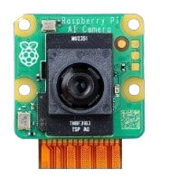
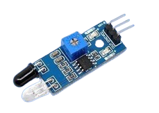
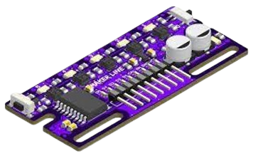

<!DOCTYPE html>
<html lang="en">
<head>
    <meta charset="UTF-8">
    <meta name="viewport" content="width=device-width, initial-scale=1.0">
    <title>My Website</title>
    
</head>
<body>
     <h1>SOLAR-CHARGED SURVEILLANCE ROBOT WITH AI-POWERED OBJECT DETECTION AND PRECISION LINE FOLLOWING</h1>

   <h2>Navigation</h2>
    <ul>
        <li><a href="#introduction">Introduction & Problem Statement</a></li>
        <li><a href="#architecture">System Architecture & Components</a></li>
        <li><a href="#features">Key Features & Functions</a></li>
        <li><a href="#results">Results & Performance</a></li>
        <li><a href="#applications">Applications</a></li>
        <li><a href="#conclusion">Conclusion & Future Improvements</a></li>
    </ul>

   

        <h2>Introduction & Problem Statement</h2>
        
<strong>Purpose:</strong> The goal is to develop an autonomous security robot for real-time monitoring and person detection.

        
<strong>Problem:</strong> Traditional security systems have limitations. This project provides an automated, continuous monitoring solution.

    

  

        <h2>System Architecture & Components</h2>
        <h3>Hardware</h3>
        <ul>
            <li><strong>Controller:</strong> Raspberry Pi Pico</li>
            <li><strong>Processing Unit:</strong> Raspberry Pi 3</li>
            <li><strong>Sensors:</strong>
                <ul>
                    <li>AI Camera</li>
                    <li>Ultrasonic & IR Sensors</li>
                    <li>Gyroscope</li>
                </ul>
            </li>
            <li><strong>Power Source:</strong> Battery & Solar Charging System</li>
        </ul>
    

   

        <h2>Key Features & Functions</h2>
        <h3>Object Detection</h3>
        
AI Camera detects movement and sends email alerts.

        

  <h3>Obstacle Avoidance</h3>
        
IR & Ultrasonic sensors help navigate safely.

        

  <h3>Path Following</h3>
        
5-channel IR sensor enables line tracking.

        
    

   

        <h2>Results & Performance</h2>
        <ul>
            <li><strong>Accuracy:</strong> Measures object detection precision.</li>
            <li><strong>Response Time:</strong> Speed of alerts from detection to notification.</li>
            <li><strong>Energy Efficiency:</strong> Power usage and battery life analysis.</li>
        </ul>
    

   

        <h2>Applications</h2>
        <ul>
            <li><strong>Security & Surveillance:</strong> Used in homes, offices, and industries.</li>
            <li><strong>Smart Monitoring:</strong> Works in smart homes & factories.</li>
        </ul>
    

  

        <h2>Conclusion & Future Improvements</h2>
        <h3>Summary</h3>
        
A smart, energy-efficient surveillance solution.

        <h3>Future Enhancements</h3>
        <ul>
            <li>Improve AI detection.</li>
            <li>Enhance low-light performance.</li>
            <li>Increase durability and reliability.</li>
        </ul>
    

</body>
</html>
